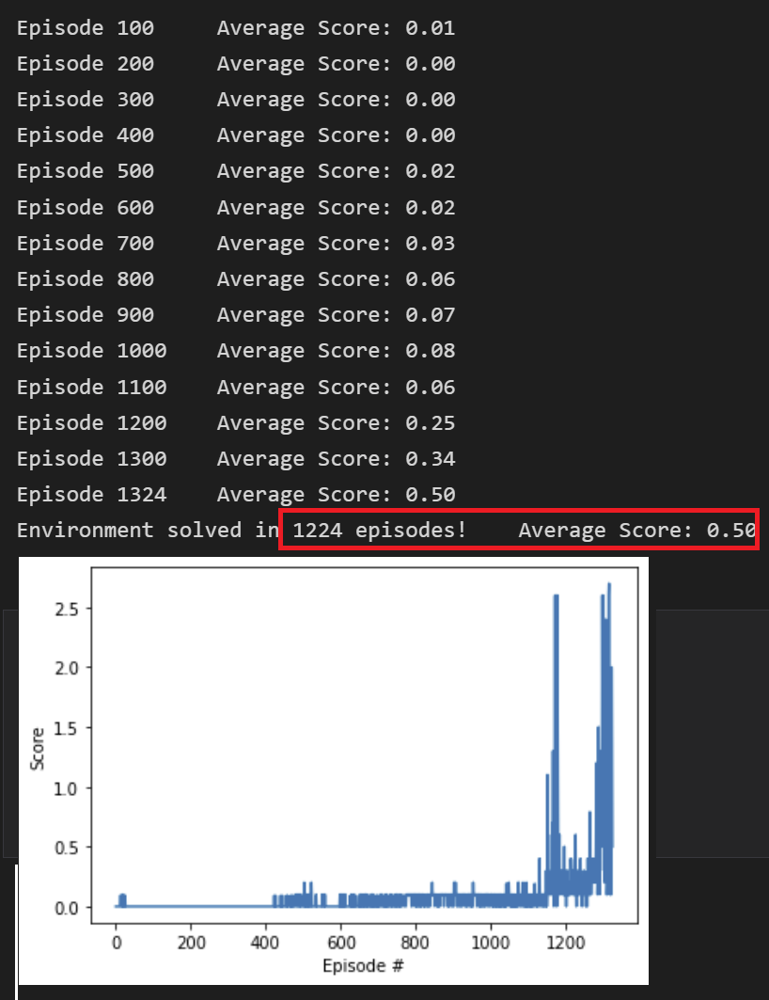

# Project 3: Collaboration and Competition

## Description of the implementation
This implementation solves the environment by 2 DDPG agents that have a shared replay buffer.

### Algorithm
The base reinforcement learning algorithm implemented to solve the multi-agent challenge for this Tennis environment is based on [DDPG](https://arxiv.org/abs/1509.02971). Intuitively, DDPG is an extension of DQN for continuous action space. It has an Actor network which tries to learn the best action given an input state of the environment and a Critic network which tries to learn an optimal action-value function based on the input state and the best action predicted by the Actor network.
There are 2 DDPG agents in this environment. Each agent has its own Actor and Critic network and receives its own local observation but as suggested in the Benchmark Implementation, they have a shared replay buffer.

### Hyperparameters
The hyperaparameters were adapted from the final solution of the second project of continuous control in this nanodegree. The only hyperparemeters that were further updated are the maximum length of each episode (max_t), replay buffer size (BUFFER_SIZE) and the number of episodes (n_episodes).

#### Final Parameters
- n_episodes: 4000
- max_t: 2000
- BUFFER_SIZE: 10^6
- BATCH_SIZE: 128
- LR_ACTOR: 3x10^-4
- LR_CRITIC: 3x10^-4
- GAMMA: 0.99
- TAU: 10^-3
- OUNoise sigma: 0.1

### Network Architecture
Each agent had its own Actor and Critic network and the network architectures were exactly the same for both agents. The network architectures were also adapted from the final solution of the second project of continuous control in this nanodegree in which "the sizes of layers were empirically modified alongwith adding a batch normalization layer after the first ReLu activation layer for both Actor and Critic networks".   

#### Final Architecture
- Actor network: 2 fully connected layers of sizes 256 and 128 respectively
- Critic network: 2 fully connected layers of sizes 256 and 128 respectively
- Batch normalization layer after the first fully connected layer

### Improvement
The DDPG was improved and adapted for this multi-agent environment by having a shared replay buffer as was suggested in the benchmark implementation instructions of the project. The shared replay buffer provided more data for training each of the agents as it could learn from the experience tuples of the other agent as well. Eventually, the environment was solved in 1224 episodes. 

## Plot of Rewards
As mentioned in the environment description of the project, after each episode we take the maximum of the scores of the 2 agents. The environment was deemed solved when the average (over 100 episodes) of this resultant score reached >= +0.5.

### Final Architecture and Hyperparameters

## Ideas for Future Work
- [MADDPG paper](https://arxiv.org/pdf/1706.02275.pdf) propositions of a centralized critic and improving the stability by training agents with an ensemble of policies could be adopted.
- Multiple parallel environments could be utilized to potentially speed up training.
- Further finetuning of the hyperparameters and architecture can be explored to make the learning faster as well as more stable.
- [Prioritized experience replay for DDPG](https://ieeexplore.ieee.org/document/8122622) can be utilized which is claimed to reduce the training time, improve training stabilty and decrease sensitivity to hyperparameters.